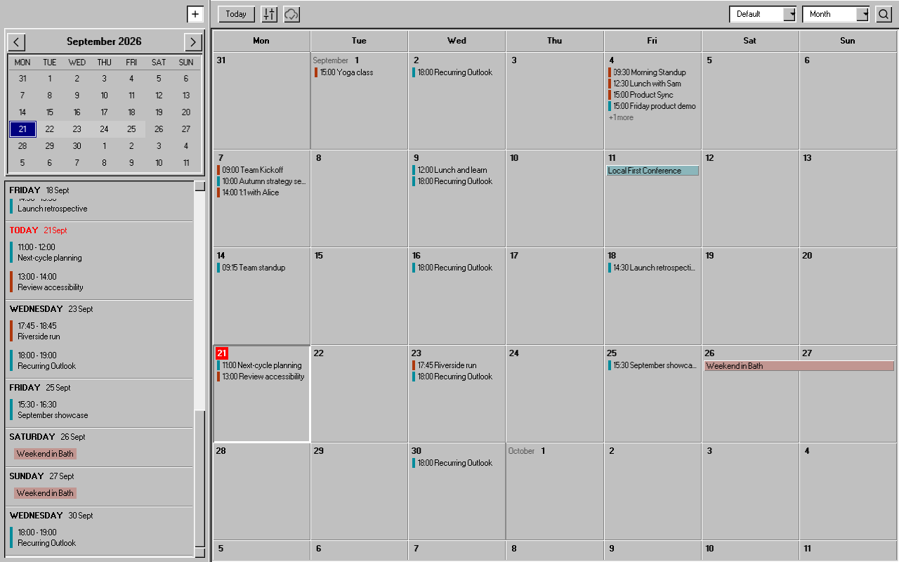
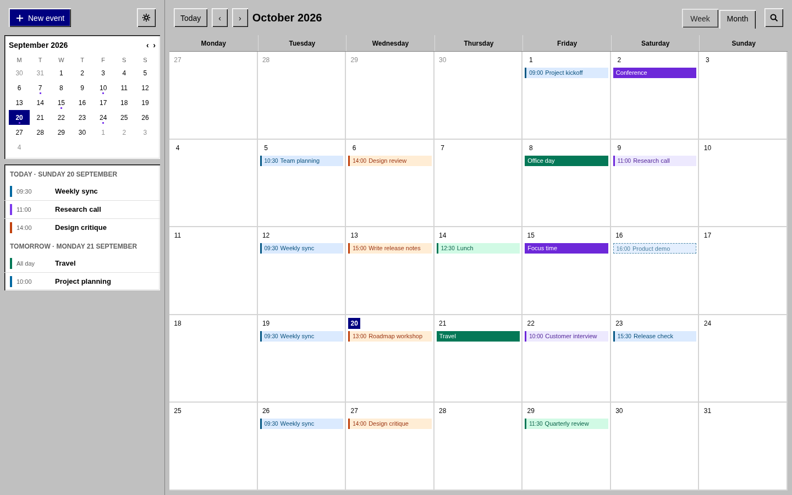
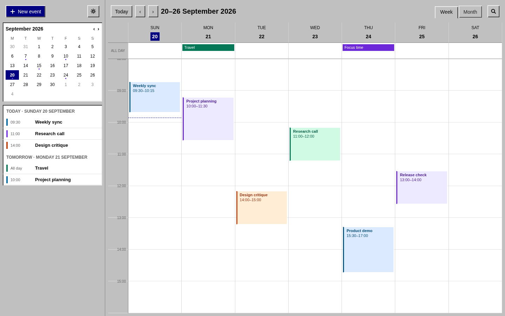
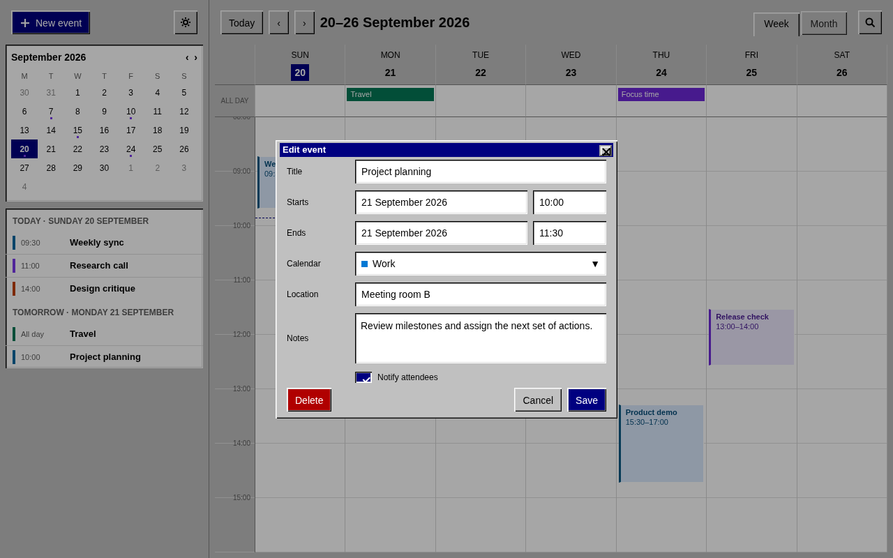

# renCal Windows 98 theme

A clean Windows 98-inspired light theme for [renCal](https://rencal.org). It
uses compact system typography, quiet white calendar surfaces, classic silver
controls, recessed work areas, navy title bars, square event blocks, property
sheet tabs, and dotted keyboard focus indicators while preserving calendar
colours and status states.



|                Month                 |                Week                |                 Event editor                  |
| :----------------------------------: | :--------------------------------: | :-------------------------------------------: |
|  |  |  |

## Installation

renCal 0.8.0 or later is required. Install from a terminal on Linux:

```sh
rencal plugin install t4t5/rencal-theme-windows98
```

Choose **Windows 98** under **Settings → Themes** after installation. The
theme is entirely self-contained CSS, so it works offline and loads no fonts,
images, scripts, or other remote resources.

## Theme design

The theme uses renCal's public theme variables for its palette, typography,
control dimensions, and square geometry. Scoped component rules then add the
parts that make the treatment more than a palette swap:

- two-step light and dark bevels on buttons, cards, dialogs, and menus;
- reversed bevels for pressed controls and recessed frames for fields;
- white calendar work areas with fine, low-contrast grid lines;
- navy selection and title strips with white text;
- property-sheet tabs, pale yellow tooltips, and dotted focus outlines;
- square calendar events that retain their calendar colours and RSVP states.

The styling is scoped to the selected theme and is removed when another theme
is selected. No Windows artwork or code from third-party CSS libraries is
included; the implementation was written for renCal, with the component
hierarchy and restrained control treatment of
[98.css](https://jdan.github.io/98.css/) as a visual reference.

## Development

Copy `themes/windows98.css` to renCal's watched custom-theme directory while
developing. The file intentionally contains bare custom-property declarations
followed by nested selectors: renCal supplies the outer theme selector when it
loads an external theme.

The screenshots use synthetic calendar data.

## License

[MIT](LICENSE)
